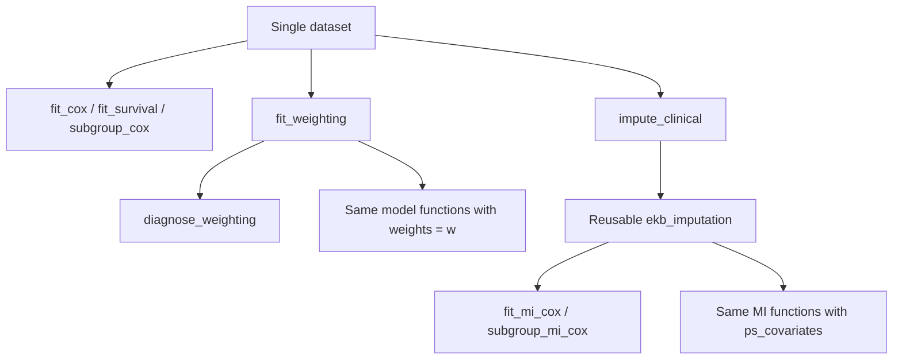

# ekbMed

**Reproducible clinical survival analysis and reporting in R.**

ekbMed provides a consistent interface for Kaplan–Meier curves, Cox regression,
propensity-score weighting, multiple imputation, subgroup treatment effects,
clinical data quality checks, and editable publication tables. It is intended
for clinical researchers and analysts working from a prespecified analysis plan.

The package provides generic analysis tools. Cohort definitions, endpoint and
censoring rules, data linkage, and study-specific processing belong in a separate
analysis project. It does not perform automatic model selection.

## Installation

Install from GitHub:

```r
install.packages("remotes")
remotes::install_github("MBender1992/ekbMed", dependencies = TRUE)
library(ekbMed)
```

To install from a local source directory, use
`remotes::install_local("path/to/ekbMed", dependencies = TRUE)`.
Using `dependencies = TRUE` installs both core and optional dependencies for
the workflows shown below.

Dependencies in `Imports` support the basic modelling and conversion API.
`Suggests` contains feature-specific backends: WeightIt/cobalt for IPTW,
mice for MI, gtsummary/survey/smd for tables, flextable/officer for Word,
ggsurvfit/patchwork for survival plotting, and RISCA for weighted log-rank tests.
The optional adjustedCurves pathway additionally uses pammtools/cowplot when
requested. A missing backend gives an actionable error; install all dependencies
to run the full suite.

## Quick start with simulated data

All examples here use simulated observations, not clinical records. Time is in
months and `event = 1` denotes the event of interest.

```r
library(ekbMed)
set.seed(410)
n <- 240
age <- rnorm(n, 60, 9)
sex <- factor(rep(c("F", "M"), length.out = n))
treatment <- factor(
  ifelse(runif(n) < plogis(0.025 * (age - 60)), "B", "A"),
  levels = c("A", "B")
)
failure <- rexp(n, 0.035 * exp(0.3 * (treatment == "B") + 0.02 * (age - 60)))
censor <- runif(n, 18, 72)
dat <- data.frame(
  time = pmin(failure, censor), event = as.integer(failure <= censor),
  treatment, age, sex
)
cox <- fit_cox(dat, "time", "event", c("treatment", "age", "sex"))
tidy_cox(cox)
```

Arguments identifying variables are character column names. The first treatment
factor level is the reference. Set levels explicitly before analysis; functions
with `treatment_reference` also allow an explicit reference argument.

## One API for the analysis workflow



| Goal | Public entry point |
|---|---|
| Single-dataset Cox | `fit_cox()` |
| Reusable PS weights | `fit_weighting()` |
| Balance, overlap, ESS | `diagnose_weighting()` |
| Weighted Cox | `fit_cox(..., weights = w)` |
| Subgroup effects | `subgroup_cox(..., weights = w)` |
| Survival curves | `fit_survival(..., weights = w)` |
| Upstream imputation | `impute_clinical()` |
| MI Cox | `fit_mi_cox(imputation = mi, ...)` |
| MI plus IPTW | `fit_mi_cox(imputation = mi, ..., ps_covariates = ...)` |
| MI subgroup effects | `subgroup_mi_cox(imputation = mi, ...)` |

## Single-dataset workflow

```r
cox <- fit_cox(dat, "time", "event", c("treatment", "age", "sex"))
check_cox_ph(cox)
cox_global_wald(cox)
format_cox(cox)
```

Models use prespecified covariates. `robust = NULL` preserves the backend's
variance selection; use `robust = TRUE` to explicitly request sandwich SE.
For ordinary models, missing model values follow `coxph` and the session's
`na.action` setting. Make a deliberate complete-case or imputation decision.

## IPTW workflow

```r
w <- fit_weighting(
  dat, treatment = "treatment", ps_covariates = c("age", "sex"),
  estimand = "ATE", treatment_reference = "A"
)
diag <- diagnose_weighting(w)
diag$balance
diag$ess
diag$ps_summary
diag$positivity_flag
plot_balance(w)

weighted_cox <- fit_cox(dat, "time", "event", "treatment",
  weights = w, robust = TRUE)
adjusted_weighted_cox <- fit_cox(dat, "time", "event",
  c("treatment", "age", "sex"), weights = w, robust = TRUE)
```

**Inspect PS diagnostics before interpreting weighted analyses.** Weights are
estimated once for the ordinary dataset and reused. They are matched by row
position: keep the same rows in the same order. No truncation or stabilization is
applied automatically. `truncate_weights()` is an explicit sensitivity-analysis
tool and returns a list whose `$weights` component can be passed downstream.

Weighted Cox models may include additional outcome covariates. Their HR is
conditional/additionally adjusted and need not equal the marginal weighted-only
HR. Such models are **not automatically doubly robust**. Robust SE do not by
themselves account for all propensity-model estimation uncertainty.

## MI workflow

```r
dat_mis <- dat
dat_mis$age[seq(5, nrow(dat_mis), 11)] <- NA_real_
mi <- impute_clinical(
  dat_mis, impute_vars = "age", predictor_vars = "sex",
  treatment = "treatment", time = "time", event = "event",
  m = 5, maxit = 5, seed = 71
)
mi_cox <- fit_mi_cox(
  imputation = mi, time = "time", event = "event",
  covariates = c("treatment", "age", "sex"), treatment = "treatment"
)
mi_cox$pooled_summary
```

MI is created **once upstream** and reused. Increase `m` and `maxit` appropriately
for the actual analysis; these small values keep the example quick. Review mice
convergence, logged events and imputed distributions. By default, survival
imputation includes the event indicator and Nelson–Aalen cumulative hazard.
Treatment and outcome fields are not imputed by this API. Missing predictors
must be explicit imputation targets. A completed imputation is not a
complete-case analysis.

## MI plus IPTW

```r
mi_weighted <- fit_mi_cox(
  imputation = mi, time = "time", event = "event",
  covariates = c("treatment", "age", "sex"), treatment = "treatment",
  ps_covariates = c("age", "sex"), treatment_reference = "A",
  estimand = "ATE", robust = TRUE
)
mi_weighted$pooled_summary
mi_weighted$diagnostic_summary
```

PS models and weights are estimated **separately in every imputation**. They are
not estimated once from averaged or stacked imputations. Models are pooled with
`mice::pool`; robust SE from the fitted models are used when present. Examine
both the concise diagnostic summary and each imputation's detailed diagnostics.

## Subgroup analyses

```r
sg <- subgroup_cox(dat, "time", "event", "treatment", "sex",
  covariates = "age", weights = w, treatment_reference = "A", robust = TRUE)
sg$results

sg_mi <- subgroup_mi_cox(mi, "time", "event", "treatment", "sex",
  covariates = "age", ps_covariates = c("age", "sex"),
  weight_scope = "global", treatment_reference = "A", robust = TRUE)
sg_mi_local <- subgroup_mi_cox(mi, "time", "event", "treatment", "sex",
  covariates = "age", ps_covariates = c("age", "sex"),
  weight_scope = "within_subgroup", treatment_reference = "A", robust = TRUE)
```

`global` subsets full-cohort weights within each imputation. `within_subgroup`
refits the PS model within each subgroup level and imputation, excluding the
subgroup variable and constant predictors. A varying PS predictor must remain.
The Overall row uses full-cohort weights in both modes. MI subgroup N is the
rounded mean across completed datasets, with `n_mean` also available.

Subgroup p-values test the treatment effect within that level. They are not
interaction tests. No interaction testing is enabled by default; MI subgroup
results do not include interaction tests.

## Survival analysis

```r
km <- fit_survival(dat, "time", "event", "treatment")
km_w <- fit_survival(dat, "time", "event", "treatment", weights = w)
summary_w <- summarize_survival(km_w, landmarks = c(12, 24, 36, 48))
summary_w$median
summary_w$landmarks
survival_logrank(dat, "time", "event", "treatment")
plot_survival(km)
plot_survival(km_w, show.p = FALSE)
```

The main API uses `survival::survfit`. Weighted log-rank testing, including a
weighted plot p-value, requires RISCA. Plot risk tables and median-summary N are
raw observation counts. Landmark `n.risk` is the backend's potentially weighted
risk count. By default, estimates are not extended beyond observed follow-up.
An optional `fit_iptw_survival()` / `plot_iptw_survival()` pathway wraps
adjustedCurves as an alternative backend.

## Publication-ready tables

```r
baseline <- tbl_baseline(dat, "treatment", c("age", "sex"))
baseline_w <- tbl_baseline(dat, "treatment", c("age", "sex"), weights = w)
regression <- tbl_cox(cox)
subgroups <- tbl_subgroup(sg)
ft <- as_ekb_flextable(baseline_w)
flextable::save_as_docx(ft, path = "baseline.docx")
```

Tables use a black-and-white journal style, bold variable blocks, sparse rules,
and editable Word output. Weighted baseline headers show **Weighted N**, the sum
of weights representing the pseudo-population, not the number of unique
patients. Unweighted tables default to p-values; weighted tables default to
absolute SMDs. `tbl_survival()` returns a tibble rather than a gtsummary object;
use `flextable::flextable(tbl_survival(summary_w))` for that output.

```r
set.seed(43)
dat$response <- factor(sample(c("CR", "PR", "SD", "PD"), nrow(dat), TRUE),
  levels = c("CR", "PR", "SD", "PD"))
dat$orr <- dat$response %in% c("CR", "PR")
dat$dcr <- dat$response %in% c("CR", "PR", "SD")
outcomes <- tbl_outcomes(dat, "treatment", best_response = "response",
  response_rates = c(ORR = "orr", DCR = "dcr"),
  survival = list(OS = c(time = "time", event = "event")),
  landmarks = c(12, 24, 36, 48), weights = w, add_p = FALSE)
as_ekb_flextable(outcomes)
```

**BOR/ORR/DCR remain unweighted observed descriptions** in this mixed table;
only survival uses the supplied weights. Its headers retain observed N, and its
heading/footnote disclose weighted survival. Response-rate columns are prepared
explicitly upstream. Preserve missing responses as NA when creating them:
`ifelse(is.na(response), NA, response %in% c("CR", "PR"))`. The standalone
`calc_ORR()` / `calc_DCR()` denominator is restricted to evaluable CR/PR/SD/PD.
The outcome table instead describes the binary columns supplied by the analyst.

## Forest plots

```r
plot_cox_forest(cox, labels = c(age = "Age", sex = "Sex"))
plot_cox_forest(mi_weighted)
plot_subgroup_forest(sg, p_type = "effect")
plot_subgroup_forest(sg_mi)
```

The ggplot outputs can be saved with `ggplot2::ggsave`. Subgroup forest p-values
refer to within-level effects; reference/comparator coding determines direction.

## Treatment-course and toxicity tables

```r
dat$end_reason <- rep(c("Completed", "Toxicity", "Progression", ""), length.out = nrow(dat))
dat$toxicity <- rep(c("Yes", "No"), length.out = nrow(dat))
dat$grade <- rep(c("1", "2", "3", ""), length.out = nrow(dat))
course <- tbl_treatment_course(dat, "treatment",
  end_reason = "end_reason", toxicity = "toxicity", toxicity_grade = "grade",
  level_order = list(end_reason = c("Completed", "Progression", "Toxicity"),
                     grade = c("1", "2", "3")), add_p = FALSE)
as_ekb_flextable(course)
```

Blank strings count as missing. Grades/types default to patients with documented
toxicity; `toxicity_details = "all"` requests the full cohort. Total is included
by default. Explicit `level_order` overrides automatic order.

## Diagnostics and conversion rules

```r
qc <- qc_clinical_data(dat, nonnegative_vars = c("time", "age"),
  required_complete_vars = c("time", "event", "treatment"), verbose = FALSE)
qc$issues
convert_date(c("2020", "2020-05", "21.05.2020"), return_details = TRUE)
calc_ORR(c("CR", "PR", "SD", "PD", NA))
```

QC reports issues without modifying data. Date completion, response mappings
and inclusive-day calculations are explicit conventions to reconcile with the
study analysis plan. They do not define generic RFS, TTNT or TOT endpoints.

## Design principles and reproducibility

- Specify covariates, estimands and factor reference levels explicitly.
- Reuse upstream imputation and ordinary-dataset weights.
- Retain warnings and errors; emit IPTW messages once at the high-level call.
- Keep missingness and conversion rules visible.
- Store `sessionInfo()`, seeds, data-processing decisions and diagnostics with each analysis.
- Keep clinical datasets and study scripts outside the package.

Legacy emR function names are available as compatibility wrappers for older
analysis scripts. New analyses should use the public API shown above.
`fit_mi_iptw_cox()` delegates to `fit_mi_cox()` and emits a deprecation warning.
See [SPECIFICATIONS.md](SPECIFICATIONS.md) for technical design details and
[NEWS.md](NEWS.md) for version changes. Function help provides argument definitions
and additional examples, for example `?fit_mi_cox` or `?tbl_outcomes`.

## Development and testing

Clone the repository and install the development dependencies. Run the following
commands from the repository root:

```r
install.packages(c("devtools", "roxygen2"))
devtools::install_deps(dependencies = TRUE)
devtools::document()
devtools::test()
devtools::check()
devtools::install()
```

`NAMESPACE` and `man/` are generated by roxygen2. The test suite uses synthetic
data and compares model estimates, weights and variance pooling against direct
calls to the underlying packages. It also checks tables, plots, input validation
and user messages. Tests do not require clinical records or network access.

Tests requiring an unavailable optional backend are reported as skipped. Install
all suggested dependencies for a complete test run. The GitHub Actions workflow
regenerates documentation and runs `R CMD check`.

## Questions and contributions

Report bugs or propose improvements through
[GitHub Issues](https://github.com/MBender1992/ekbMed/issues). For bug reports,
include a minimal reproducible example using synthetic or public data, the error
message and `sessionInfo()`. Do not include identifiable patient information.

## License

MIT © Marc Bender. See [LICENSE.md](LICENSE.md) for the full license.
